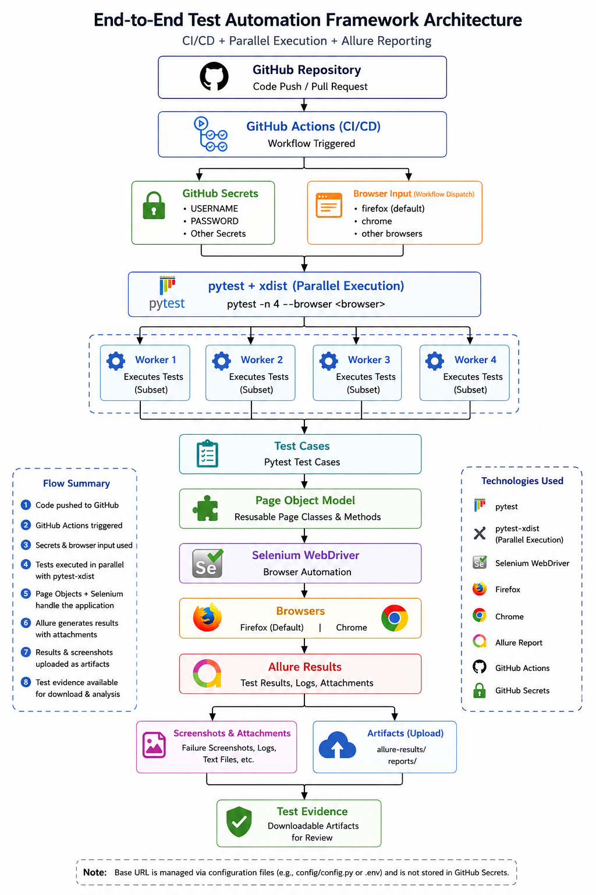

# OrangeHRM Selenium Python Automation Framework

> **A production-grade Page Object Model (POM) test automation framework built with Python, Selenium, and pytest — covering the OrangeHRM HR Management System.**

---

## 👤 Author

**16+ Years of Automation Experience** | Senior Automation Engineer
**Skills:** Java · C# · Python · Selenium · pytest · RestAssured · API Automation
**Transitioning to:** Senior SDET | Test Architect | GCC & Product Companies

---

## 📌 Project Overview

This framework demonstrates end-to-end UI test automation for the **OrangeHRM** open-source HR application using Python and Selenium WebDriver.

It is designed using industry-standard patterns — **Page Object Model (POM)**, **pytest fixtures**, **JSON-driven test data**, **automatic failure screenshots**, **parallel execution**, **GitHub Actions CI/CD**, and **Allure result generation** — making it maintainable, scalable, and production-ready.

The project covers **34 test cases** across **5 modules** — Login, User Management, Job Titles, Nationalities, and Locations — with both positive and negative scenarios.

---

## 🛠️ Tech Stack

| Category           | Technology                                 |
| ------------------ | ------------------------------------------ |
| Language           | Python 3.x                                 |
| Browser Automation | Selenium WebDriver 4.x                     |
| Test Framework     | pytest                                     |
| Parallel Execution | pytest-xdist                               |
| Test Reporting     | pytest-html                                |
| Allure Reporting   | allure-pytest                              |
| CI/CD              | GitHub Actions                             |
| Browser Support    | Firefox · Chrome                           |
| Test Data          | JSON (one file per test case)              |
| Logging            | Python logging (StreamHandler, INFO level) |
| Configuration      | ConfigParser (`config.ini`)                |
| Secrets            | GitHub Actions Secrets                     |
| Design Pattern     | Page Object Model (POM)                    |

---

## 🏗️ Framework Architecture



### Framework Structure

```text
orangehrm-selenium-python/
│
├── config/
│   └── config.ini                  # Application URL and framework configuration
│
├── pages/                          # Page Object classes (POM layer)
│   ├── base_page.py                # BasePage — shared Selenium actions and utilities
│   ├── login/
│   │   └── login_page.py           # Login and logout page actions
│   └── admin/
│       ├── admin_page.py            # Admin module navigation
│       ├── job/
│       │   └── add_job_page.py      # Job Titles page actions
│       ├── user_management/
│       │   └── add_user_page.py     # User Management page actions
│       ├── nationalities/
│       │   └── nationalities_page.py
│       └── organization/
│           └── locations_page.py
│
├── tests/                          # Test cases (one file per test case)
│   ├── login/                      # Login module tests (7 tests)
│   └── admin/
│       ├── job/                    # Job Titles module tests (6 tests)
│       ├── user_management/        # User Management module tests (16 tests)
│       ├── nationalities/          # Nationalities module tests (3 tests)
│       └── organization/           # Locations module tests (4 tests)
│
├── test_data/                      # JSON test data
│   ├── login/
│   └── admin/
│       ├── job/
│       ├── user_management/
│       ├── nationalities/
│       └── organization/
│
├── utilities/
│   ├── config_reader.py            # Reads config.ini via ConfigParser
│   ├── driver_factory.py           # Creates Firefox or Chrome WebDriver
│   ├── logger.py                   # Configures Python logger per module
│   └── test_data_reader.py         # Auto-maps test file path to JSON data
│
├── reports/
│   ├── report.html                 # Auto-generated HTML test report
│   └── screenshots/                # Auto-captured failure screenshots
│
├── allure-results/                 # Generated locally/CI; do not commit
│
├── conftest.py                     # pytest fixtures and failure screenshot hook
├── pytest.ini                      # pytest configuration, markers and Allure settings
├── requirements.txt                # Python dependencies
└── .github/
    └── workflows/
        └── *.yml                   # GitHub Actions CI/CD workflow
```

---

## ✨ Key Framework Features

### 1. Robust BasePage with Smart Wait Strategies

`base_page.py` is the heart of the framework — it contains reusable Selenium actions used by all page objects:

* **`click_after_form_loader()`** — Custom wait that blocks interaction until the OrangeHRM form loader overlay disappears, then retries on `ElementClickInterceptedException`.
* **`wait_for_form_loader_to_disappear()`** — Explicit wait with configurable timeout for full-page loaders.
* **`get_existing_record()`** — Dynamically selects a random existing row from any table.
* **`get_search_header_index()`** — Resolves table column index dynamically by matching header text.
* **`delete_record()`** — Row-traversal delete implementation that works across table modules.
* **`confirm_deletion()`** — Reusable delete confirmation dialog handler.
* **`get_field_validation_error()`** — Dynamic validation error reader using label-based XPath.
* **`click_dropdown_option()`** and **`enter_field_input()`** — Generic form helpers using label-anchored dynamic locators.

### 2. Automatic Test Data Mapping

`TestDataReader` eliminates hardcoded test data paths. It automatically maps the current test file path to the corresponding JSON data file:

```text
tests/admin/job/test_TC_JT_001_add_job_title_valid.py
        ↓
test_data/admin/job/TC_JT_001_add_job_title_valid.json
```

The `test_data` fixture in `conftest.py` uses `request.node.fspath` to resolve this mapping at runtime.

### 3. Fixture-Chained Login Flow

Login and navigation are handled through a clean fixture chain:

```text
browser_Instance
       ↓
  login_page
       ↓
   logged_in
       ↓
logged_in_admin
```

Every test that needs an authenticated Admin session simply requests `logged_in_admin`.

### 4. Automatic Failure Screenshots

The `pytest_runtest_makereport` hook captures a screenshot automatically when a test fails:

```python
@pytest.hookimpl(hookwrapper=True)
def pytest_runtest_makereport(item, call):
    # Captures screenshot to reports/screenshots/<test_name>.png
```

No manual screenshot code is required in test files.

### 5. Browser Selection

Tests can be executed against supported browsers without changing framework code:

```bash
pytest --browser firefox
pytest --browser chrome
```

Firefox is the default browser.

### 6. Parallel Test Execution

The framework supports parallel execution through **pytest-xdist**.

Run four workers locally:

```bash
pytest -n 4
```

The GitHub Actions pipeline also executes the test suite using four parallel workers:

```bash
pytest -n 4 --browser <browser>
```

This allows the test suite to distribute tests across multiple pytest workers.

### 7. GitHub Actions Browser Selection

The GitHub Actions workflow supports browser selection through workflow input.

The browser can be selected when triggering the workflow, with Firefox used as the default when no browser is specified.

Conceptually:

```text
GitHub Actions
      ↓
Browser Input
      ↓
pytest -n 4 --browser <browser>
      ↓
Selenium WebDriver
      ↓
Firefox / Chrome
```

### 8. GitHub Secrets

Sensitive login credentials are provided to GitHub Actions through **GitHub Secrets**.

The CI environment uses secrets for:

```text
USERNAME
PASSWORD
```

The **BASE URL is not stored as a GitHub Secret**. The application URL remains part of the framework configuration.

This separation keeps credentials out of the source repository while allowing the framework configuration to define the target application.

### 9. Allure Result Generation

The framework uses:

```text
allure-pytest
```

and pytest is configured to generate results in:

```text
allure-results/
```

Allure results include:

* Test result JSON files
* Test container JSON files
* Attachments
* Logs/text attachments
* Failure-related evidence

Allure results are generated during the same pytest execution used by CI.

### 10. GitHub Actions Artifact Upload

After the CI test execution, the generated Allure results are uploaded as a GitHub Actions artifact.

The CI flow is:

```text
pytest
   ↓
allure-results/
   ↓
GitHub Actions artifact
   ↓
Download for analysis
```

This allows the generated Allure result files to be downloaded directly from the completed GitHub Actions run.

### 11. Dynamic Data for Uniqueness

All create scenarios append a random number suffix to prevent duplicate data failures across repeated test runs:

```python
job_title = test_data["job_title"] + add_job_page.get_random_number(2, 999)
```

### 12. Pagination-Aware Nationality Search

The `is_nationality_present()` method in `NationalitiesPage` traverses all table pages using the pagination next-arrow, verifying records across the full dataset.

---

## 📋 Test Coverage

### Module 1: Login (7 Tests)

| Test ID   | Scenario                             | Type     |
| --------- | ------------------------------------ | -------- |
| TC_LI_001 | Valid login with correct credentials | Positive |
| TC_LI_002 | Login with invalid username          | Negative |
| TC_LI_003 | Login with invalid password          | Negative |
| TC_LI_004 | Login with empty username            | Negative |
| TC_LI_005 | Login with empty password            | Negative |
| TC_LI_006 | Login with both fields empty         | Negative |
| TC_LO_001 | Logout successfully                  | Positive |

### Module 2: Admin > Job Titles (6 Tests)

| Test ID   | Scenario                                              | Type     |
| --------- | ----------------------------------------------------- | -------- |
| TC_JT_001 | Add a valid job title and verify in list              | Positive |
| TC_JT_002 | Submit empty job title — verify validation error      | Negative |
| TC_JT_003 | Add duplicate job title — verify Already exists error | Negative |
| TC_JT_004 | Edit an existing job title — verify success           | Positive |
| TC_JT_005 | Delete an existing job title — verify success         | Positive |
| TC_JT_006 | Verify Job Titles submenu visible under Job menu      | Positive |

### Module 3: Admin > User Management (16 Tests)

| Test ID   | Scenario                                        | Type     |
| --------- | ----------------------------------------------- | -------- |
| TC_UM_001 | Add valid user with all fields                  | Positive |
| TC_UM_002 | Add user with duplicate username — verify error | Negative |
| TC_UM_003 | Submit user form with empty required fields     | Negative |
| TC_UM_004 | Submit with mismatched password — verify error  | Negative |
| TC_UM_005 | Search user by exact username                   | Positive |
| TC_UM_006 | Search users filtered by Admin role             | Positive |
| TC_UM_007 | Search users filtered by ESS role               | Positive |
| TC_UM_008 | Search users filtered by Enabled status         | Positive |
| TC_UM_009 | Edit user — change User Role                    | Positive |
| TC_UM_010 | Edit user — change Status                       | Positive |
| TC_UM_011 | Delete a single user                            | Positive |
| TC_UM_012 | Delete multiple users                           | Positive |
| TC_UR_001 | Verify users with Admin role in search results  | Positive |
| TC_UR_002 | Verify users with ESS role in search results    | Positive |

### Module 4: Admin > Nationalities (3 Tests)

| Test ID   | Scenario                       | Type     |
| --------- | ------------------------------ | -------- |
| TC_NT_001 | Add a new nationality          | Positive |
| TC_NT_002 | Edit an existing nationality   | Positive |
| TC_NT_003 | Delete an existing nationality | Positive |

### Module 5: Admin > Locations (4 Tests)

| Test ID   | Scenario                                            | Type     |
| --------- | --------------------------------------------------- | -------- |
| TC_OL_001 | Add a valid location with all details               | Positive |
| TC_OL_002 | Submit location with empty name — verify validation | Negative |
| TC_OL_003 | Search location by name — verify result             | Positive |
| TC_OL_004 | Delete location by name                             | Positive |

**Total: 34 Test Cases | 24 Positive | 10 Negative**

---

## 🚀 How to Run

### Prerequisites

* Python 3.8 or above
* Firefox or Chrome browser installed
* Git

### Setup

```bash
# 1. Clone the repository
git clone https://github.com/<your-username>/orangehrm-selenium-python.git
cd orangehrm-selenium-python

# 2. Create a virtual environment (recommended)
python -m venv .venv

# Windows
.venv\Scripts\activate

# Mac / Linux
source .venv/bin/activate

# 3. Install dependencies
pip install -r requirements.txt
```

### Run Tests

```bash
# Run all tests (default: Firefox)
pytest

# Run on Chrome
pytest --browser chrome

# Run on Firefox
pytest --browser firefox

# Run with 4 parallel workers
pytest -n 4

# Run parallel tests on Chrome
pytest -n 4 --browser chrome

# Run parallel tests on Firefox
pytest -n 4 --browser firefox

# Run specific module only
pytest tests/admin/job/
pytest tests/login/
pytest tests/admin/user_management/

# Run by marker
pytest -m smoke
pytest -m regression

# Run a single test
pytest tests/admin/job/test_TC_JT_001_add_job_title_valid.py
```

---

## ⚙️ Configuration

The application URL is maintained in:

```text
config/config.ini
```

Example:

```ini
[application]
url = https://opensource-demo.orangehrmlive.com
login_username = Admin
login_password = admin123
```

> **CI/CD note:** In GitHub Actions, sensitive credentials should be supplied through GitHub Secrets rather than committed credentials. The BASE URL is maintained separately as framework configuration and is **not stored in GitHub Secrets**.

---

## 🔐 GitHub Actions CI/CD

The framework is integrated with GitHub Actions for automated test execution.

### CI Pipeline

```text
Git Push / Workflow Dispatch
            ↓
     GitHub Actions
            ↓
   Setup Python Environment
            ↓
   Install Dependencies
            ↓
   GitHub Secrets
   USERNAME / PASSWORD
            ↓
      Browser Input
   Firefox / Chrome
            ↓
      pytest + xdist
        -n 4
            ↓
       Selenium WebDriver
            ↓
       Test Execution
            ↓
      Allure Results
            ↓
    Failure Screenshots
            ↓
   Upload CI Artifacts
```

### Browser Selection

The workflow supports browser selection through workflow input.

Example command used by CI:

```bash
pytest -n 4 --browser <browser>
```

Firefox is used as the default browser when no browser input is supplied.

### Parallel Execution

GitHub Actions runs the test suite using four pytest-xdist workers:

```bash
pytest -n 4
```

This enables parallel execution and reduces overall test execution time.

### Secrets

GitHub Actions Secrets are used for sensitive credentials:

```text
USERNAME
PASSWORD
```

The BASE URL is **not** stored as a GitHub Secret and remains part of framework configuration.

### Allure Results

The CI run generates:

```text
allure-results/
```

The directory contains Allure result files and attachments generated during test execution.

### CI Artifacts

The generated Allure results are uploaded as a GitHub Actions artifact.

The artifact can be downloaded from the completed workflow run for further analysis.

---

## 📊 Markers

| Marker                    | Purpose                      |
| ------------------------- | ---------------------------- |
| `@pytest.mark.smoke`      | Critical business flow tests |
| `@pytest.mark.regression` | Full regression suite        |
| `@pytest.mark.sanity`     | Quick sanity checks          |

---

## 📸 Failure Screenshots

When a test fails, a screenshot is automatically captured and saved to:

```text
reports/screenshots/<test_name>.png
```

No code is required in the test file — screenshot capture is handled entirely by the `pytest_runtest_makereport` hook in `conftest.py`.

Failure screenshots can also be retained as part of the CI test evidence.

---

## 📦 CI Test Evidence

The CI pipeline produces multiple forms of test evidence:

```text
Test Execution
      │
      ├── pytest results
      │
      ├── Allure result files
      │
      ├── Attachments
      │
      └── Failure screenshots
              │
              ▼
       GitHub Actions
          Artifacts
```

This provides downloadable test evidence after the CI workflow completes.

---

## 🔮 Planned Enhancements

* [ ] Playwright Python migration (in progress — Month 7 of SDET learning roadmap)
* [ ] API test layer using pytest + requests + BDD
* [ ] Jenkins CI/CD pipeline integration
* [ ] Docker containerisation for cross-environment runs
* [ ] AWS cloud execution support
* [ ] Enhanced Allure HTML report publishing
* [ ] Additional cross-browser CI matrix execution

---

## 📄 License

This project is open-source and available for learning and portfolio purposes.

---

*Built as Milestone 1 of a structured SDET upskilling roadmap — transitioning from 16+ years of Java/C# automation to Python, AI testing, and cloud-native quality engineering.*